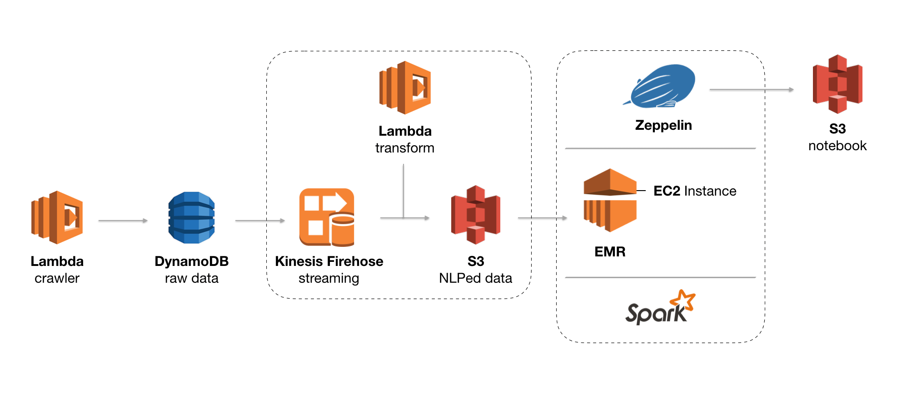

## Architecture


## Trouble Shooting
### serverless
  * lambda function 내 module을 import 못하는 에러
    * [serverless-python-requirements](https://github.com/UnitedIncome/serverless-python-requirements)로 해결
      * `requirements.txt` 내에 사용할 module들을 선언 -> 해당 환경 만들어줌
      * dockerize도 함(deploy시 local에 docker가 도는 상태여야 함)
    * 참고
      * [Serverless: Python - virtualenv - { "errorMessage": "Unable to import module 'handler'" }](https://markhneedham.com/blog/2017/08/06/serverless-python-virtualenv-errormessage-unable-import-module-handler/)
  * no module name: konlpy
    * [이슈](https://github.com/konlpy/konlpy/issues/71)를 보니 konlpy의 dependency인 Jpype가 문제가 있어서 람다가 안 돈다.
      * Jpype, Jpype1-py3, numpy 다 줘도 konlpy를 못찾는다 ^^..... 대체 왜
### EMR
  * 웹 연결 활성화(Amazon EMR 클러스터에 설치되는 애플리케이션은 마스터 노드에 호스팅된 웹 사이트로 사용자 인터페이스를 게시)를 위해 마스터 노드(EC2 인스턴스)에 대한 SSH 터널 열기 & 프록시 관리 도구 구성이 필요
    * EC2 key pair가 필요
    * 이 key pair는 EMR cluster 생성 시 필요하다
      * EC2 마스터 노드의 security rule에 22번 포트로 접근하는 ssh 액세스 허용 규칙이 없는 경우, [추가](https://docs.aws.amazon.com/ko_kr/AWSEC2/latest/UserGuide/authorizing-access-to-an-instance.html)
      * [Unprotected Private Key File Error](https://docs.aws.amazon.com/ko_kr/AWSEC2/latest/UserGuide/TroubleshootingInstancesConnecting.html#troubleshoot-unprotected-key)
    * [FoxyProxy](https://chrome.google.com/webstore/detail/foxyproxy-standard/gcknhkkoolaabfmlnjonogaaifnjlfnp?hl=ko) 설치 후, 관련 [설정](https://docs.aws.amazon.com/ko_kr/emr/latest/ManagementGuide/emr-connect-master-node-proxy.html#emr-connect-foxy-proxy-chrome)
  * Zeppelin에서 코드 실행시, java.net.ConnectException: Connection refused (Connection refused) 발생
    * Interpreter 설정이 제대로 안되어있는 문제(EC2에 당연히 Interpreter가 깔려있다고 생각했다..)
      * [anaconda](https://www.anaconda.com/) 설치
        * [EC2 인스턴스에 anaconda 설치](https://hackernoon.com/aws-ec2-part-3-installing-anaconda-on-ec2-linux-ubuntu-dbef0835818a)
        * [Spark Cluster 구축하기](https://dziganto.github.io/amazon%20emr/apache%20spark/apache%20zeppelin/big%20data/From-Zero-to-Spark-Cluster-in-Under-Ten-Minutes/)
        * 과정
          * ssh 접속
          ```
          // Anaconda installer archive(https://repo.continuum.io/archive/index.html)
          wget https://repo.continuum.io/archive/Anaconda2-5.3.0-Linux-x86_64.sh -O ~/anaconda.sh

          bash ~/anaconda.sh -b -p $HOME/anaconda

          echo -e '\nexport PATH=$HOME/anaconda/bin:$PATH' >> $HOME/.bashrc && source $HOME/.bashrc

          // 경로 확인
          which python
          ```
          * zeppelin 내 interpreter 설정에서 python의 `zeppelin.python`과 `zeppelin.pyspark.python`의 value를 `/home/hadoop/anaconda/bin/python`로 변경
        * python package 설치는 `conda install package-name`
          * anaconda가 지원하지 않는 패키지는 `pip`로 설치
        * EMR 클러스터를 다시 올릴 때마다, EC2 인스턴스 자체가 새로 올라가므로 매번 위의 과정을 해줘야하는데 귀찮으니 자동화하자
          * EMR 클러스터 생성시, bootstrap 옵션에 사용자 지정 옵션을 줄 수 있다.
          * s3내에 위의 명령어들이 있는 `.sh` 파일을 업로드한 후, 해당 파일로 지정하자.
          * 클러스터를 생성할 때 마다 bootstrap action을 수행하는 자동 구성 단계를 거쳐준다.
          * 참고
            * [Amazon EMR - From Anaconda To Zeppelin](https://dziganto.github.io/zeppelin/spark/zeppelinhub/emr/anaconda/tensorflow/shiro/s3/theano/bootstrap%20script/EMR-From-Scratch/)
  * Zeppelin의 notebook이 cluster 재실행 시 날아감
    * S3에 json으로 저장
      * cluster 생성 시, 다음 configuration 입력
      ```
      [
        {
          "Classification": "zeppelin-env",
          "Properties": {},
          "Configurations": [
            {
              "Classification": "export",
              "Properties": {
                "ZEPPELIN_NOTEBOOK_STORAGE": "org.apache.zeppelin.notebook.repo.S3NotebookRepo",
                "ZEPPELIN_NOTEBOOK_S3_BUCKET": "s3-bucket-name",
                "ZEPPELIN_NOTEBOOK_S3_USER": "user-name"
              },
              "Configurations": []
            }
          ]
        }
      ]
      ```
      * 새 클러스터 생성시 기존 노트북을 S3에서 로드하게 된다.
### Spark
  * SparkSession object 생성시 java.io.FileNotFoundException: /stderr (Permission denied) 발생
    * EMR 버전을 5.18.0 밑으로 낮추면 된다
    * [참고](https://stackoverflow.com/questions/53140852/cant-get-a-sparkcontext-in-new-aws-emr-cluster)
### Kinesis
  * 중간에 data transform시, [return 형식](https://docs.aws.amazon.com/ko_kr/firehose/latest/dev/data-transformation.html)이 있다.
  * 그 중 recordId는 publish 한 쪽에서 온 recordId와 transform 후 return할 해당 record의 recordId가 같아야한다.
    * 이 recordId가 내가 직접 준 id값이라는 생각에 잡혀가지고 엄청난 삽질을 했다..
    * 넘어온 event의 records를 찍어보면 내가 지정한 id가 아닌, record마다 recordId를 부여해서 넘어오는 것을 볼 수 있다.


## Retrospect
* 크롤링 raw data를 s3에 넣을껄!
  * dynamo는 Availability를 보장하는데, 이 프로젝트에는 그런 real-time을 보장받기 보다는 S3를 쓰는 것이 더 목적에 맞는 느낌..
    *  [AWS Glue와 S3를 이용한 아키텍쳐 사례](https://aws.amazon.com/blogs/big-data/build-a-data-lake-foundation-with-aws-glue-and-amazon-s3/)
    * 이외에도 보통 이런 목적에는 S3를 많이 쓰는 사례를 많이 찾아볼 수 있다.
  * 그래도 dynamodb를 써봤다는 것에 만족!
* 크롤러들 serverless 배포시 virtualenv 설정을 안했다!
  * 간단한데 왜 안했지 바보
* kinesis가 stream으로 들어오는 데이터를 nlp해서 그걸 가지고 하둡을 돌리는 그런 구조를 생각했는데, konlpy가 올라가지 않아서 transforming하는 middleware가 그냥 받은 데이터 뱉기밖에 못한게 아쉽다.
  * 프로젝트 주제 특성상, 이미 야구 시즌이 끝나서 더이상 크롤링하지 않기 때문에 원래 생각한 동적인 구조(스케쥴 걸어놓은 람다 -> kinesis firehose에서 streaming으로 nlp -> s3에 쌓기 -> MR)대로 흘러갈 수는 없지만, 틀은 그렇게 만들어보면서 재미있었다 :D
